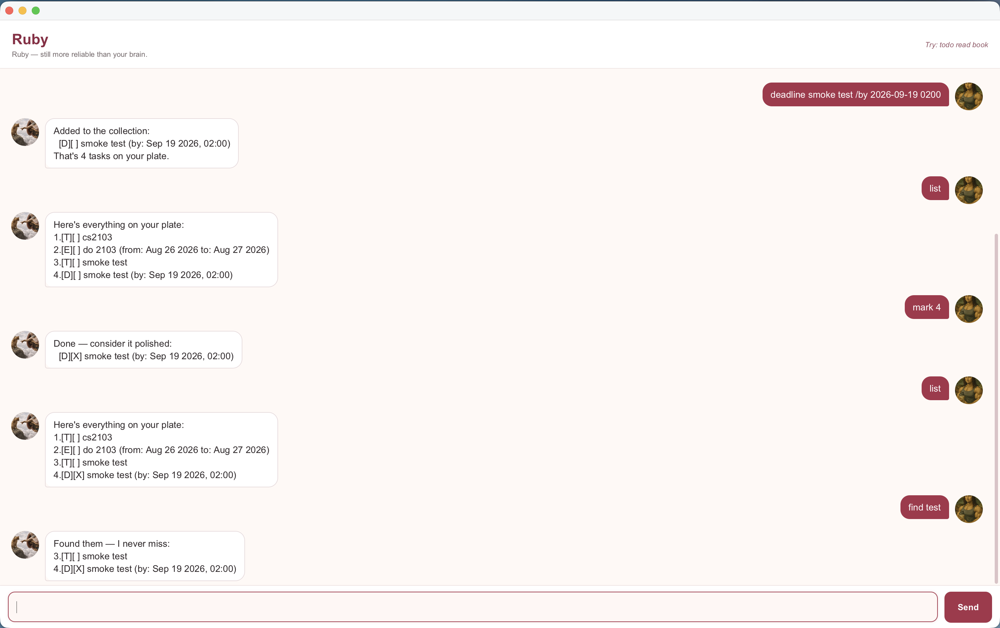

# Ruby User Guide

Ruby is a gem among task managers: brilliant, a little vain, and secretly
proud of you. She tracks your tasks and contacts with high standards, teases
your typos, and never forgets a name.



## Meet Ruby

* **Name:** Ruby.
* **Personality:** a precious gem — confident, playful, and a perfectionist
  about your schedule. She teases the mistake, never the person.
* **Look:** rose and maroon, a cat for a face, and a fondness for shine.

Example exchanges:

```
> todo read book
Added to the collection:
  [T][ ] read book
That's 1 task on your plate.
```

```
> nonsense
Hold on — That's not in my repertoire. Try a command I know.
```

```
> bye
Bye. Your tasks are in precious hands.
```

## Quick start

1. Make sure you have JDK 25 installed.
1. From the project root, launch Ruby with `./gradlew run`. If you use an IDE,
   you can instead run `Launcher.main()`.
1. Ruby's window opens with a greeting. Type a command into the text box and
   press Enter; Ruby's reply appears in the conversation above.
1. Ruby saves your tasks and contacts automatically to `data/ruby.txt`, and
   loads them again the next time you start her.

## Command rules

* Type commands in lowercase.
* Use single spaces only — no leading or trailing spaces, and no tabs.
* `INDEX` is the number shown next to an item by `list`, starting from 1.
* Task descriptions and contact details cannot contain `|`.
* Ruby refuses to add a task or contact that duplicates one you already have.

## Adding a todo: `todo`

Adds a task with no date attached.

Format: `todo DESCRIPTION`

```
> todo read book
Added to the collection:
  [T][ ] read book
That's 1 task on your plate.
```

## Adding a deadline: `deadline`

Adds a task to be done by a date, or by a date and time.

Format: `deadline DESCRIPTION /by DATE_OR_TIME`

* `DATE_OR_TIME` is `yyyy-mm-dd` (e.g. `2019-10-15`) or `yyyy-mm-dd HHmm`
  (e.g. `2026-10-15 1800`).

```
> deadline return book /by 2019-10-15
Added to the collection:
  [D][ ] return book (by: Oct 15 2019)
That's 2 tasks on your plate.
```

## Adding an event: `event`

Adds a task that runs from a start date and time to an end date and time.

Format: `event DESCRIPTION /from START /to END`

* `START` and `END` use the same date formats as deadlines.
* The event must end after it starts.

```
> event project meeting /from 2019-10-15 1400 /to 2019-10-15 1600
Added to the collection:
  [E][ ] project meeting (from: Oct 15 2019, 14:00 to: Oct 15 2019, 16:00)
That's 3 tasks on your plate.
```

## Listing all tasks: `list`

Shows every task, numbered in the order you added them.

Format: `list`

```
> list
Here's everything on your plate:
1.[T][ ] read book
2.[D][ ] return book (by: Oct 15 2019)
3.[E][ ] project meeting (from: Oct 15 2019, 14:00 to: Oct 15 2019, 16:00)
```

## Finding tasks: `find`

Searches the text Ruby shows for each task, including its dates, and ignores
case.

Format: `find KEYWORD`

```
> find book
Found them — I never miss:
1.[T][ ] read book
2.[D][ ] return book (by: Oct 15 2019)
```

If nothing matches, Ruby replies:
`Nothing. Even I can't find what isn't there.`

## Marking a task as done: `mark`

Format: `mark INDEX`

```
> mark 1
Done — consider it polished:
  [T][X] read book
```

## Marking a task as not done: `unmark`

Format: `unmark INDEX`

```
> unmark 1
Undone — brilliance takes time:
  [T][ ] read book
```

## Deleting a task: `delete`

Format: `delete INDEX`

```
> delete 1
Removed — gone without a trace:
  [T][ ] read book
That leaves 2 tasks on your plate.
```

## Managing contacts

Ruby can keep a list of contacts alongside your tasks. A contact has a required
name and optional phone number, email address, and address.

Add a contact with `contact add`, supplying optional fields with `/phone`,
`/email`, and `/address` in any order:

```
contact add John Doe /phone 91234567 /email john@example.com /address 123 Street
Saved. I never forget a name:
  John Doe | 91234567 | john@example.com | 123 Street
That's 1 contact in your circle.
```

List your contacts with `contact list`:

```
contact list
Your circle, as requested:
1. John Doe | 91234567 | john@example.com | 123 Street
```

Delete a contact by its number in the list with `contact delete INDEX`:

```
contact delete 1
Removed from your circle:
  John Doe | 91234567 | john@example.com | 123 Street
That leaves 0 contacts in your circle.
```

Rules:

* Contacts need a name. I can't remember someone with no name.
* Phone numbers need at least 3 digits, with an optional leading `+`.
* Emails must look like `name@example.com`.
* The `|` character is not allowed in contact details.
* Unknown, repeated, or empty fields are rejected.

## Exiting Ruby: `bye`

Format: `bye`

```
> bye
Bye. Your tasks are in precious hands.
```

## Command summary

| Action | Format |
|--------|--------|
| Add a todo | `todo DESCRIPTION` |
| Add a deadline | `deadline DESCRIPTION /by DATE_OR_TIME` |
| Add an event | `event DESCRIPTION /from START /to END` |
| List tasks | `list` |
| Find tasks | `find KEYWORD` |
| Mark a task as done | `mark INDEX` |
| Mark a task as not done | `unmark INDEX` |
| Delete a task | `delete INDEX` |
| Add a contact | `contact add NAME [/phone PHONE] [/email EMAIL] [/address ADDRESS]` |
| List contacts | `contact list` |
| Delete a contact | `contact delete INDEX` |
| Exit Ruby | `bye` |
